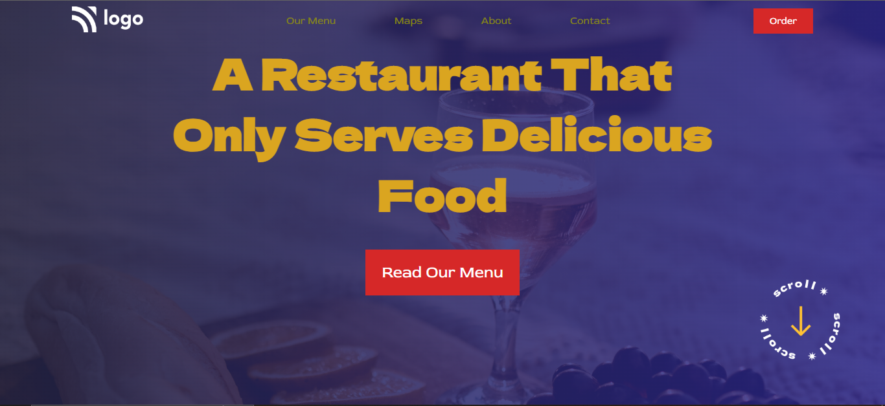

# Project 02: Food Restaurant Home Page using HTML  and CSS 

Chandrakala P

## Final Look of the Webpage:

### Live project Link:

[project link](https://restaraurant-land-page-project2.netlify.app/)

## What I learnt from this Project?

- This project helped to understand the whole idea of Html and css
- I learnt most of the basics tags in html and many properties in css.
- This project helped to me understand specially the positioning and many types of positioning in css and list, flex property.

## Stacks and Tools:

- HTML and CSS
- HTML : list, p, heading tags, button, img, and many more
- CSS: positions, margin, padding, bgc, color, text-decorations align items, display, flex, text align, absolute relative fixed positions.

## It took around 2 hrs.
